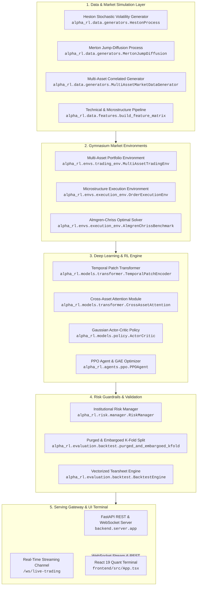
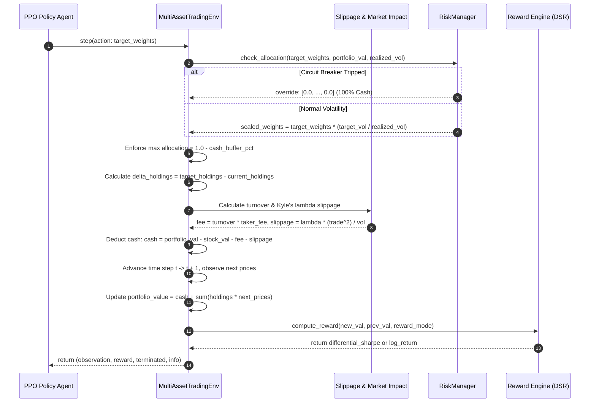
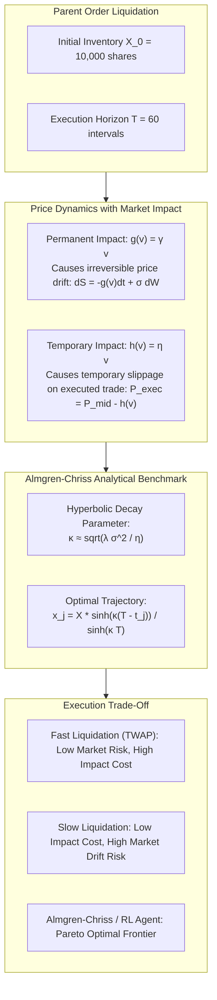
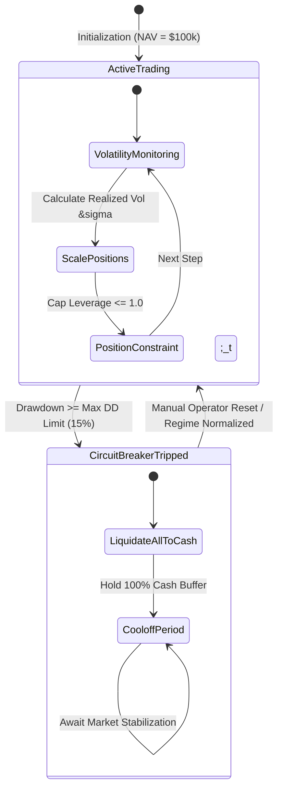
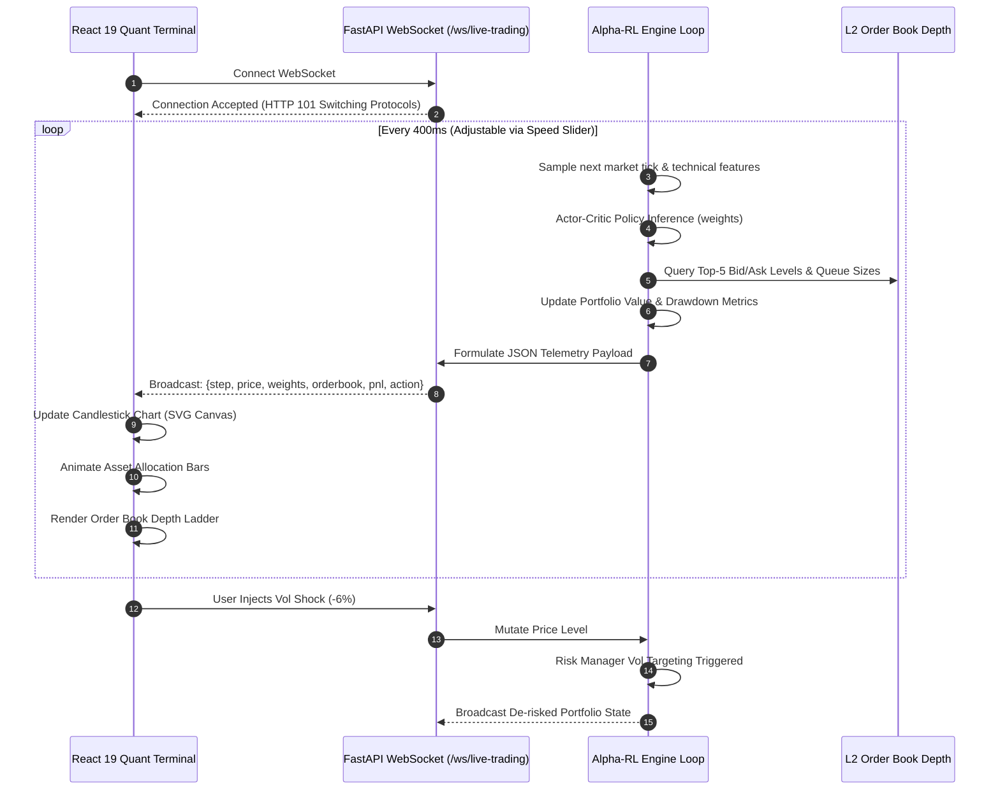

# Alpha-RL Architecture Specification

Alpha-RL is an institutional-grade deep reinforcement learning platform engineered specifically for quantitative finance, multi-asset portfolio rebalancing, and high-frequency optimal order execution.

This document details the architectural blueprints, mathematical foundations, data contracts, and component interaction models of the system.

---

## 1. High-Level Macro Architecture

The system is organized into five decoupled yet harmonized layers:



---

## 2. Neural Policy Architecture: Temporal Patch Transformer

Financial series contain localized temporal momentum and cross-asset correlation. Alpha-RL replaces slow recurrent architectures with a hybrid **Strided Patch Temporal Transformer** and **Cross-Asset Attention** mechanism.

```mermaid
graph LR
    subgraph Input ["Input Tensor"]
        Raw["Observation Tensor<br/>(B, T=20, F=6)"]
    end

    subgraph Patching ["Patch Temporal Tokenization"]
        Unfold["Strided Unfold<br/>(B, N_patches=9, F=6, P=4)"]
        LinearProj["Linear Projection<br/>Linear(P=4, d_model=64)"]
    end

    subgraph Attention ["Cross-Asset Multi-Head Attention"]
        MeanPool["Mean Across Patches<br/>(B, F=6, d_model=64)"]
        MHA["Multi-Head Self-Attention<br/>4 Heads, Pre-LN, GELU FFN"]
        Residual["Residual + LayerNorm"]
    end

    subgraph Pooling ["Trunk Pooling"]
        GlobalPool["Feature Dimension Mean<br/>(B, d_model=64)"]
        OutProj["Trunk Projection<br/>Linear(64, 128) + Tanh"]
    end

    subgraph Heads ["Dual Actor-Critic Heads"]
        subgraph Actor ["Gaussian Actor"]
            ActorMLP["Linear(128, 128) -> Tanh -> Linear(128, A)"]
            Sigmoid["Sigmoid Simplex Mean &mu;(s)"]
            LogStd["Clamped log(&sigma;) &isin; [-20, 2]"]
            NormalDist["Reparameterized Normal(&mu;, &sigma;)"]
        end

        subgraph Critic ["Value Critic"]
            CriticMLP["Linear(128, 128) -> Tanh -> Linear(128, 1)"]
            ScalarValue["Scalar Value V(s)"]
        end
    end

    Raw --> Unfold --> LinearProj --> MeanPool --> MHA --> Residual --> GlobalPool --> OutProj
    OutProj --> ActorMLP --> Sigmoid --> NormalDist
    LogStd --> NormalDist
    OutProj --> CriticMLP --> ScalarValue
```



### Mathematical Formulation

1. **Strided Patch Unfolding**:
   For lookback series $X \in \mathbb{R}^{B \times T \times F}$, we apply window slicing of length $P=4$ and stride $S=2$:
   $$X_{\text{patch}} = \text{unfold}(X, \text{size}=P, \text{step}=S) \in \mathbb{R}^{B \times N_p \times F \times P}$$
   $$Z_p = W_{\text{proj}} X_{\text{patch}} + b_{\text{proj}} \in \mathbb{R}^{B \times N_p \times F \times D}$$

2. **Cross-Asset Attention**:
   With $H = 4$ attention heads, we model correlation between asset features:
   $$\text{Attention}(Q, K, V) = \text{softmax}\left(\frac{Q K^T}{\sqrt{d_k}}\right) V$$
   $$\tilde{Z} = \text{LayerNorm}(Z + \text{MHA}(Z, Z, Z))$$

3. **Gaussian Policy Output**:
   The action vector $a \in [0, 1]^A$ represents target asset allocation weights:
   $$\mu(s) = \sigma(\text{Linear}(h)), \quad \log \sigma(s) = \text{clamp}(\theta_{\sigma}, -20, 2)$$
   $$a \sim \mathcal{N}(\mu(s), \sigma(s)^2), \quad a_{\text{clamped}} = \text{clip}(a, 0, 1)$$

---

## 3. Environment Step Lifecycle & Microstructure Engine

The trading environment enforces physical execution constraints, non-negative cash balances, transaction fee schedules, and market impact slippage.



---

## 4. Almgren-Chriss Optimal Liquidation Microstructure

For optimal execution of large parent orders without moving the market, Alpha-RL implements the Almgren & Chriss (2000) optimal liquidation framework:



---

## 5. Institutional Risk Circuit Breaker State Machine

The Risk Management Layer safeguards the portfolio against catastrophic drawdowns and regime changes:



---

## 6. Purged & Embargoed Walk-Forward Validation

Standard random K-Fold cross-validation causes fatal data leakage in financial machine learning due to overlapping return labels and serial correlation. Alpha-RL enforces **Purged and Embargoed Walk-Forward Splitting**:

```mermaid
gantt
    title Purged and Embargoed Walk-Forward Validation (Fold i)
    dateFormat  X
    axisFormat %s

    section Train Left
    Training Segment 1        :done, train1, 0, 35
    section Purge Gap 1
    Purged Overlap Window     :crit, purge1, 35, 38
    section Test Split
    Test Evaluation Fold      :active, test, 38, 60
    section Post-Test Embargo
    Embargo Buffer (2%)       :crit, embargo, 60, 64
    section Train Right
    Training Segment 2        :done, train2, 64, 100
```



- **Purging**: Removes training samples whose labels overlap with the test fold window.
- **Embargoing**: Inserts an embargo period immediately following the test fold to prevent autoregressive information leakage into subsequent training intervals.

---

## 7. Real-Time Telemetry & WebSocket Streaming Loop

The WebSocket architecture allows sub-millisecond dispatch of tick updates, live model weights, and order book states to the web terminal:



---

## 8. Directory & Dependency Map

```
alpha-rl/
├── alpha_rl/
│   ├── agents/
│   │   └── ppo.py                 # PPO implementation with GAE and value clipping
│   ├── data/
│   │   ├── generators.py          # Heston, Merton Jump-Diffusion, and Multi-Asset data
│   │   └── features.py            # Garman-Klass, Parkinson, RSI, MACD, Bollinger Bands
│   ├── envs/
│   │   ├── trading_env.py         # Gymnasium multi-asset continuous trading env
│   │   └── execution_env.py       # Almgren-Chriss L2 order book execution env
│   ├── evaluation/
│   │   └── backtest.py            # Purged & Embargoed K-Fold split and tear-sheet
│   ├── models/
│   │   ├── policy.py              # Continuous Gaussian Actor & Value Critic
│   │   └── transformer.py         # Patch Temporal Transformer & Cross-Asset Attention
│   └── risk/
│       └── manager.py             # Max Drawdown circuit breaker & Volatility targeting
├── backend/
│   └── server.py                  # FastAPI REST and WebSocket streaming gateway
├── frontend/                      # React 19 + TypeScript + Vite quant web terminal
├── tests/                         # Pytest unit and integration test suite
├── .github/workflows/ci.yml       # GitHub Actions CI matrix
├── pyproject.toml                 # Package definition
├── requirements.txt
└── README.md
```
