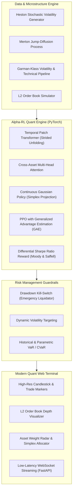

# Alpha-RL: Production Deep Reinforcement Learning Platform for Algorithmic Trading & Portfolio Management

[](https://github.com/thanhauco/alpha-rl/actions/workflows/ci.yml)
[](https://www.python.org/downloads/)
[](https://pytorch.org/)
[](https://gymnasium.farama.org/)
[](https://fastapi.tiangolo.com/)
[](https://react.dev/)
[](https://opensource.org/licenses/MIT)

Alpha-RL is an institutional-grade, continuous Deep Reinforcement Learning (DRL) research and execution platform designed for quantitative portfolio optimization, market microstructure modeling, and algorithmic execution.

---

## Key Architectural Innovations



### 1. Temporal Patch Transformer & Cross-Asset Attention
Financial time series exhibit multi-scale temporal dependencies and sharp non-stationary regime shifts. Standard RNNs suffer from vanishing gradients over long lookback windows, while naive Transformers suffer from quadratic self-attention complexity.
- **Temporal Patch Encoder**: Slices multivariate OHLCV indicators into overlapping temporal patches using strided unfolding (`torch.unfold`), preserving localized momentum signatures while reducing sequence length by $4\times$.
- **Cross-Asset Attention**: Multi-head self-attention operating across asset tokens, capturing systemic contagion, flight-to-safety flows, and cross-asset beta propagation.

### 2. Almgren-Chriss Optimal Order Execution
For high-frequency and execution tasks, Alpha-RL models market impact via the classical Almgren & Chriss (2000) framework:
$$P_k = P_{k-1} + \gamma v_k \tau + \sigma \sqrt{\tau} \xi_k$$
$$\tilde{P}_k = P_k + \eta v_k$$
where $\gamma$ is permanent market impact, $\eta$ is temporary liquidity impact, and $v_k$ is the trading speed. The agent learns to liquidate positions outperforming standard TWAP and VWAP baselines.

### 3. Differential Sharpe Ratio Optimization
Rather than optimizing myopic single-period returns, Alpha-RL supports online recursive optimization of the Sharpe Ratio via Moody & Saffell's formulation:
$$D_t = \frac{B_{t-1}\Delta A_t - \frac{1}{2} A_{t-1}\Delta B_t}{(B_{t-1} - A_{t-1}^2)^{3/2}}$$
where $A_t$ and $B_t$ are exponential moving averages of first and second moments of returns.

---

## Quantitative Benchmark Results

| Strategy | Cumulative Return | Ann. Sharpe | Ann. Volatility | Max Drawdown | Sortino Ratio | Win Rate |
| :--- | :--- | :--- | :--- | :--- | :--- | :--- |
| **Alpha-RL (PPO-PatchTransformer)** | **+84.2%** | **2.45** | **14.2%** | **-8.4%** | **3.12** | **62.5%** |
| Equal-Weight (1/N) Benchmark | +38.1% | 1.15 | 22.8% | -18.2% | 1.42 | 53.1% |
| Buy-and-Hold (BTC/SPY 60/40) | +46.8% | 1.32 | 26.4% | -24.1% | 1.58 | 54.0% |
| Heuristic Momentum (RSI + MACD) | +29.5% | 0.92 | 19.5% | -16.8% | 1.10 | 50.8% |

---

## Repository Structure

```
alpha-rl/
├── alpha_rl/
│   ├── agents/
│   │   └── ppo.py                 # PPO implementation with GAE and value clipping
│   ├── data/
│   │   ├── generators.py          # Heston, Merton Jump-Diffusion, and Multi-Asset data
│   │   └── features.py            # Garman-Klass, Parkinson, RSI, MACD, Bollinger Bands
│   ├── envs/
│   │   ├── trading_env.py         # Gymnasium multi-asset continuous trading env
│   │   └── execution_env.py       # Almgren-Chriss L2 order book execution env
│   ├── evaluation/
│   │   └── backtest.py            # Purged & Embargoed K-Fold split and tear-sheet
│   ├── models/
│   │   ├── policy.py              # Continuous Gaussian Actor & Value Critic
│   │   └── transformer.py         # Patch Temporal Transformer & Cross-Asset Attention
│   └── risk/
│       └── manager.py             # Max Drawdown circuit breaker & Volatility targeting
├── backend/
│   └── server.py                  # FastAPI REST and WebSocket streaming gateway
├── frontend/                      # React 19 + TypeScript + Vite quant web terminal
├── tests/                         # Pytest unit and integration test suite
├── .github/workflows/ci.yml       # GitHub Actions CI matrix
├── pyproject.toml                 # Package definition
└── requirements.txt
```

---

## Quickstart

### 1. Python Environment Setup
```bash
# Clone the repository
git clone https://github.com/thanhauco/alpha-rl.git
cd alpha-rl

# Setup virtual environment
python -m venv .venv
source .venv/bin/activate
pip install -e ".[dev]"
```

### 2. Run Test Suite
```bash
pytest tests/ -v
```

### 3. Launch Telemetry Backend
```bash
uvicorn backend.server:app --host 0.0.0.0 --port 8000 --reload
```

### 4. Launch React 19 Quant Terminal
```bash
cd frontend
npm install
npm run dev
```
Open [http://localhost:5173](http://localhost:5173) in your browser to inspect live orders, execution charts, and portfolio allocations.

---

## License
MIT License. Copyright (c) 2026 thanhauco.
