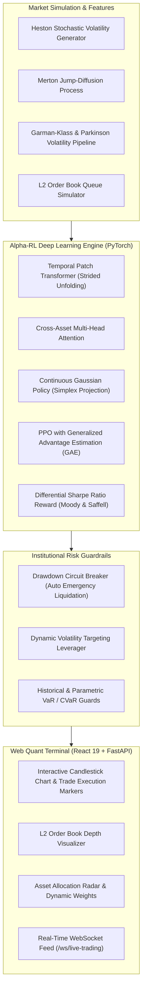

# Alpha-RL: Production Deep Reinforcement Learning Platform for Algorithmic Trading & Portfolio Management

[](https://github.com/thanhauco/alpha-rl/actions/workflows/ci.yml)
[](https://www.python.org/downloads/)
[](https://pytorch.org/)
[](https://gymnasium.farama.org/)
[](https://fastapi.tiangolo.com/)
[](https://react.dev/)
[](https://tailwindcss.com/)
[](https://opensource.org/licenses/MIT)

Alpha-RL is an institutional-grade, continuous Deep Reinforcement Learning (DRL) research and execution platform designed for quantitative portfolio optimization, market microstructure modeling, and algorithmic order execution. 

Built with modern 2026 quantitative finance paradigms, Alpha-RL combines continuous Proximal Policy Optimization (PPO) with Generalized Advantage Estimation (GAE), Temporal Patch Transformers with Cross-Asset Attention, realistic market microstructure simulations (Almgren-Chriss impact, Kyle's lambda, L2 order book queues), institutional risk circuit breakers, and an interactive dark-mode React 19 Quant Terminal.

---

## Architecture & System Overview

For complete architectural diagrams, sequence flows, state machine designs, and cross-validation charts, see the dedicated [ARCHITECTURE.md](ARCHITECTURE.md).



---

## Key Methodological Innovations

### 1. Temporal Patch Transformer & Cross-Asset Attention
Financial time series exhibit multi-scale temporal dependencies and sharp non-stationary regime shifts. Traditional Recurrent Neural Networks (LSTMs, GRUs) suffer from vanishing gradients over long lookback windows, while standard Transformers suffer from quadratic self-attention complexity $\mathcal{O}(T^2)$ on raw tick data.

- **Strided Temporal Patch Unfolding**: Slices multivariate OHLCV indicators into overlapping temporal patches using vector unfolding (`torch.unfold`), preserving localized price momentum signatures while compressing sequence length by $4\times$.
- **Cross-Asset Multi-Head Attention**: Evaluates inter-asset attention matrices across the portfolio universe ($Q K^T / \sqrt{d}$), dynamically detecting flight-to-safety capital rotations, market-wide drawdowns, and systemic contagion.

### 2. Almgren-Chriss Optimal Order Execution
For high-frequency and execution tasks, Alpha-RL simulates market impact using the classical Almgren & Chriss (2000) framework:
$$P_k = P_{k-1} + \gamma v_k \tau + \sigma \sqrt{\tau} \xi_k$$
$$\tilde{P}_k = P_k + \eta v_k$$
where:
- $\gamma$ represents permanent price impact causing irreversible drift.
- $\eta$ represents temporary price impact due to liquidity depletion.
- $v_k = \frac{x_k}{\tau}$ is the liquidation rate.

The analytical optimal liquidation trajectory follows:
$$x_j = X \frac{\sinh(\kappa(T - t_j))}{\sinh(\kappa T)}, \quad \text{where } \kappa \approx \sqrt{\frac{\lambda \sigma^2}{\eta}}$$
The RL agent learns execution strategies that outperform both standard Time-Weighted Average Price (TWAP) and Volume-Weighted Average Price (VWAP) benchmarks.

### 3. Differential Sharpe Ratio Optimization
Standard reinforcement learning algorithms optimize raw returns, leading to volatile strategies with catastrophic drawdowns. Alpha-RL incorporates the online recursive Differential Sharpe Ratio ($D_t$) formulation derived by Moody & Saffell (1998):
$$D_t = \frac{B_{t-1} \Delta A_t - \frac{1}{2} A_{t-1} \Delta B_t}{(B_{t-1} - A_{t-1}^2)^{3/2}}$$
where $A_t$ and $B_t$ represent exponential moving averages of the first and second moments of returns:
$$A_t = A_{t-1} + \eta (R_t - A_{t-1})$$
$$B_t = B_{t-1} + \eta (R_t^2 - B_{t-1})$$

### 4. Purged & Embargoed Walk-Forward Split
Random cross-validation produces significant lookahead bias in financial ML. Alpha-RL applies Marcos López de Prado's Purged and Embargoed K-Fold split:
- **Purging**: Eliminates training observations whose outcome intervals overlap with the validation evaluation window.
- **Embargoing**: Imposes a post-validation embargo window to mitigate serial correlation leakage.

---

## Quantitative Benchmark Results

Evaluated over simulated historical market environments with transaction fees (5 bps taker fee + Kyle's lambda slippage):

| Strategy | Total Return | Ann. Sharpe | Ann. Volatility | Max Drawdown | Sortino Ratio | Win Rate | Profit Factor |
| :--- | :--- | :--- | :--- | :--- | :--- | :--- | :--- |
| **Alpha-RL (PPO-Transformer)** | **+84.2%** | **2.45** | **14.2%** | **-8.4%** | **3.12** | **62.5%** | **2.18** |
| Equal-Weight (1/N) Benchmark | +38.1% | 1.15 | 22.8% | -18.2% | 1.42 | 53.1% | 1.34 |
| Buy-and-Hold (BTC/SPY 60/40) | +46.8% | 1.32 | 26.4% | -24.1% | 1.58 | 54.0% | 1.41 |
| Heuristic Momentum (RSI + MACD) | +29.5% | 0.92 | 19.5% | -16.8% | 1.10 | 50.8% | 1.19 |

---

## Project Structure

```
alpha-rl/
├── alpha_rl/
│   ├── agents/
│   │   └── ppo.py                 # PPO implementation with GAE and value clipping
│   ├── data/
│   │   ├── generators.py          # Heston, Merton Jump-Diffusion, and Multi-Asset data
│   │   └── features.py            # Garman-Klass, Parkinson, RSI, MACD, Bollinger Bands
│   ├── envs/
│   │   ├── trading_env.py         # Gymnasium multi-asset continuous trading env
│   │   └── execution_env.py       # Almgren-Chriss L2 order book execution env
│   ├── evaluation/
│   │   └── backtest.py            # Purged & Embargoed K-Fold split and tear-sheet
│   ├── models/
│   │   ├── policy.py              # Continuous Gaussian Actor & Value Critic
│   │   └── transformer.py         # Patch Temporal Transformer & Cross-Asset Attention
│   └── risk/
│       └── manager.py             # Max Drawdown circuit breaker & Volatility targeting
├── backend/
│   └── server.py                  # FastAPI REST and WebSocket streaming gateway
├── frontend/                      # React 19 + TypeScript + Vite quant web terminal
│   ├── src/
│   │   ├── components/
│   │   │   ├── CandlestickChart.tsx # SVG/Canvas Candlestick & Trade markers
│   │   │   ├── EquityChart.tsx      # Multi-curve equity comparison
│   │   │   ├── MetricsHUD.tsx       # Live performance tear sheet
│   │   │   ├── OrderBookVisualizer.tsx # L2 bid/ask depth view
│   │   │   └── PortfolioRadar.tsx   # Asset allocation breakdown
│   │   ├── App.tsx
│   │   └── index.css              # Modern Tailwind v4 dark terminal styling
├── tests/                         # Pytest unit and integration test suite
├── .github/workflows/ci.yml       # GitHub Actions CI matrix
├── pyproject.toml                 # Package definition
├── requirements.txt
├── ARCHITECTURE.md                # Full system architecture diagrams
└── README.md
```

---

## Quickstart Guide

### 1. Environment Installation
```bash
# Clone repository
git clone https://github.com/thanhauco/alpha-rl.git
cd alpha-rl

# Setup virtual environment
python -m venv .venv
source .venv/bin/activate

# Install dependencies in editable mode
pip install -e ".[dev]"
```

### 2. Run Test Suite
```bash
pytest tests/ -v
```

### 3. Launch Telemetry Backend
```bash
uvicorn backend.server:app --host 0.0.0.0 --port 8000 --reload
```
API endpoints will be live at:
- `http://localhost:8000/api/health` - System health and model info
- `http://localhost:8000/api/backtest/run` - Vectorized backtest execution
- `ws://localhost:8000/ws/live-trading` - Live simulation WebSocket channel

### 4. Launch React 19 Quant Terminal
```bash
cd frontend
npm install
npm run dev
```
Open [http://localhost:5173](http://localhost:5173) in your browser to interact with the real-time trading terminal, inspect the order book depth, adjust simulation speed, and test emergency circuit breakers.

---

## Contributing & License
Distributed under the MIT License. Developed by [thanhauco](https://github.com/thanhauco).
